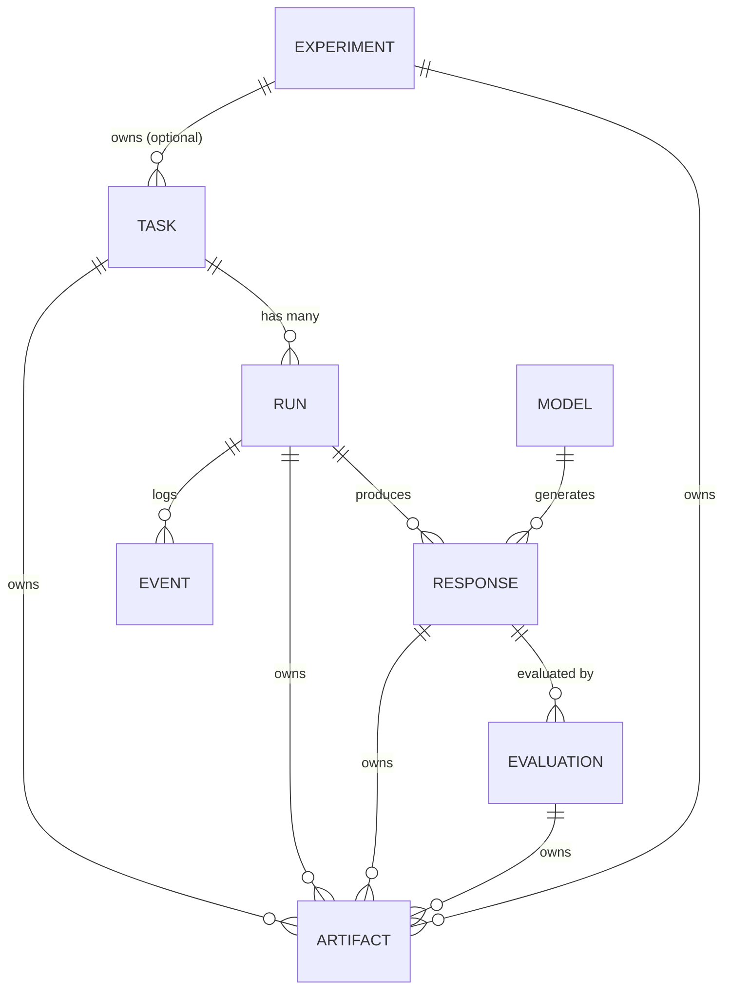

# Phase 1: Postgres Schema Design – Arena Mode MVP + ACAR

**Version:** 1.3
**Date:** 2026-01-25
**Stack:** FastAPI + PostgreSQL + SQLAlchemy + Alembic
**Scope:** Arena Mode (MVP) + ACAR Integration (v0.2) + Phase 22-E (v1.3)

---

## 0. Prerequisites

```sql
-- Required PostgreSQL extension for UUID generation
CREATE EXTENSION IF NOT EXISTS pgcrypto;

-- Required for ACAR Experience embeddings (v1.2)
CREATE EXTENSION IF NOT EXISTS vector;
```

---

## 1. Table Overview & Relationships



### Minimal Table List (8 core + 1 stub + 3 ACAR + 2 Phase 22-E)

| Table | Purpose | Append-Only? |
|-------|---------|--------------|
| `tasks` | User requests with constraints | No (mutable in DRAFT only) |
| `runs` | Execution attempts (reproducibility unit) | Yes (status updates only) |
| `responses` | Model outputs per run | Yes |
| `evaluations` | Judge verdicts and scores | Yes (invalidation allowed) |
| `events` | Audit log of all state changes | **Strict append-only** |
| `artifacts` | Stored files/bundles | Yes (status updates only) |
| `models` | LLM registry with pricing | No (reference data) |
| `judges` | Evaluator identity registry | No (reference data) |
| `experiments` | *Stub for future* | Yes |
| **`experiences`** | *(v1.2)* ACAR learned experiences | Yes (count updates only) |
| **`decision_traces`** | *(v1.2)* ACAR decision audit trails | **Strict append-only** |
| **`deliberation_rounds`** | *(v1.2)* ACAR judge deliberation rounds | **Strict append-only** |
| **`ult_decisions`** | *(v1.3)* (Ult) escalation decisions | **Strict append-only** |
| **`jungler_logs`** | *(v1.3)* (Jungler) retrieval logs | Yes (counterfactual update only) |

---

## 2. Enums (Aligned to contracts.md §2)

### 2.1 TaskStatus
```sql
CREATE TYPE task_status AS ENUM ('DRAFT', 'READY', 'ARCHIVED');
```
**Source:** contracts.md §2.1 ✓

---

### 2.2 RunStatus
```sql
CREATE TYPE run_status AS ENUM (
    'PENDING',
    'EXECUTING',
    'COLLECTING',
    'VERIFYING',
    'RANKING',
    'SCORING',
    'COMPLETED',
    'FAILED_TIMEOUT',
    'FAILED_INSUFFICIENT_CANDIDATES',
    'FAILED_ALL_DISQUALIFIED',
    'FAILED_BUDGET_EXCEEDED',
    'CANCELLED'
);
```

> [!NOTE]
> **Design Decision (Confirmed 2026-01-13):**
> Keep granular runtime states in DB; treat contracts.md `RUNNING` as a derived coarse status.
> - DB stores: `EXECUTING`, `COLLECTING`, `VERIFYING`, `RANKING` (from runtime.md)
> - API/UI can map these to `RUNNING` for simplified display
> - `WAITING_RETRY` omitted (MVP has no auto-retries per runtime.md §4)

---

### 2.3 ResponseStatus
```sql
CREATE TYPE response_status AS ENUM (
    'PENDING',
    'RECEIVED',
    'VALIDATED',
    'DISQUALIFIED',
    'EVALUATED',
    'WINNER'
);
```
**Source:** contracts.md §2.4 ✓

---

### 2.4 EvaluationStatus
```sql
CREATE TYPE evaluation_status AS ENUM ('PENDING', 'COMPLETED', 'INVALIDATED');
```
**Source:** contracts.md §2.5 ✓

---

### 2.5 ArtifactStatus
```sql
CREATE TYPE artifact_status AS ENUM (
    'CREATED',
    'STORING',
    'STORED',
    'VERIFIED',
    'FAILED_RETRYABLE',
    'FAILED_TERMINAL'
);
```
**Source:** contracts.md §2.6 ✓

---

### 2.6 ExperimentStatus (Stub)
```sql
CREATE TYPE experiment_status AS ENUM (
    'CREATED',
    'RUNNING',
    'PAUSED',
    'COMPLETED',
    'FAILED_TERMINAL',
    'CANCELLED'
);
```
**Source:** contracts.md §2.3 ✓

---

### 2.7 EventType (runtime.md §4)
```sql
CREATE TYPE event_type AS ENUM (
    'RUN_CREATED',
    'STATE_TRANSITION',
    'MODEL_CALL_STARTED',
    'MODEL_CALL_COMPLETED',
    'MODEL_FAILURE',
    'RESPONSE_VALIDATED',
    'RESPONSE_REJECTED',
    'VERIFICATION_COMPLETED',
    'DISQUALIFICATION',
    'RANKING_COMPLETED',
    'SCORING_COMPLETED',
    'WINNER_SELECTED',
    'BUDGET_WARNING'
);
```
**Source:** runtime.md §4 Event Taxonomy ✓

---

### 2.8 FailureType (runtime.md §4)
```sql
CREATE TYPE failure_type AS ENUM (
    'TIMEOUT',
    'SERVER_ERROR',
    'RATE_LIMITED',
    'INVALID_RESPONSE',
    'CONTEXT_OVERFLOW'
);
```
**Source:** runtime.md §4 ✓

---

### 2.9 BudgetStatus (runtime.md §5)
```sql
CREATE TYPE budget_status AS ENUM (
    'WITHIN_BUDGET',
    'OVER_BUDGET',
    'SEVERE_OVERAGE'
);
```
**Source:** runtime.md §5 ✓

---

### 2.10 ArtifactOwnerType
```sql
CREATE TYPE artifact_owner_type AS ENUM (
    'TASK',
    'RUN',
    'RESPONSE',
    'EVALUATION',
    'EXPERIMENT'
);
```
**Source:** contracts.md §6.10 ✓

---

### 2.11 JudgeType
```sql
CREATE TYPE judge_type AS ENUM ('MODEL', 'HUMAN', 'RULE', 'HYBRID');
```
**Source:** contracts.md §6.5 + evaluation.md §3 (added `RULE`, `HYBRID`) ✓

---

### 2.12 FailureMode (v1.2 — ACAR)
```sql
CREATE TYPE failure_mode AS ENUM (
    'missed_constraint',
    'hallucination',
    'verbosity_violation',
    'logical_gap',
    'format_error',
    'incomplete',
    'unjustified_refusal',
    'off_topic',
    'overconfidence'
);
```
**Source:** contracts.md v0.2 §6.6, PRD v1.6 §8.8 ✓

---

### 2.13 ExperienceType (v1.2 — ACAR)
```sql
CREATE TYPE experience_type AS ENUM ('contrastive', 'direct');
```
**Source:** contracts.md v0.2 §6.11 ✓

---

### 2.14 TaxonomyClass (v1.2 — ACAR)
```sql
CREATE TYPE taxonomy_class AS ENUM (
    'factual_qa',
    'explanation',
    'comparison',
    'planning',
    'code_generation',
    'analysis',
    'synthesis',
    'reasoning'
);
```
**Source:** contracts.md v0.2 §6.1, PRD v1.6 §10.10 ✓

---

### 2.15 SigmaBand (v1.3 — Phase 22-E)
```sql
CREATE TYPE sigma_band AS ENUM ('low', 'medium', 'high');
```
**Source:** PHASE22E_SPEC.md §2.3 ✓

---

### 2.16 ExecutionMode (v1.3 — Phase 22-E)
```sql
CREATE TYPE execution_mode AS ENUM ('single_agent', 'arena_lite', 'full_arena');
```
**Source:** PHASE22E_SPEC.md §2.4 ✓

---

## 3. Table Definitions

### 3.1 `tasks`

| Column | Type | Nullable | Default | Notes |
|--------|------|----------|---------|-------|
| `task_id` | `UUID` | NO | `gen_random_uuid()` | **PK** |
| `title` | `VARCHAR(255)` | NO | | Short title |
| `description` | `TEXT` | NO | | Full user ask |
| `task_type` | `VARCHAR(50)` | NO | | e.g., "arena", "benchmark" |
| `taxonomy_class` | `taxonomy_class` | YES | | *(v1.2)* Locked taxonomy per PRD v1.6 |
| `constraints` | `JSONB` | NO | `'[]'` | Array of constraint strings |
| `status` | `task_status` | NO | `'DRAFT'` | |
| `experiment_id` | `UUID` | YES | | FK → experiments (nullable = standalone) |
| `supersedes_task_id` | `UUID` | YES | | FK → tasks (self-ref for versioning) |
| `ground_truth_ref` | `VARCHAR(255)` | YES | | Reference for benchmarked tasks |
| `tags` | `JSONB` | YES | `'[]'` | Array of tag strings |
| `max_total_cost_usd` | `DECIMAL(10,4)` | YES | | Budget cap |
| `expected_output_tokens` | `INTEGER` | YES | | For verbosity scoring |
| `created_at` | `TIMESTAMPTZ` | NO | `NOW()` | |
| `updated_at` | `TIMESTAMPTZ` | NO | `NOW()` | |

**Indexes:**
- `idx_tasks_status` on `(status)`
- `idx_tasks_experiment_id` on `(experiment_id)` WHERE NOT NULL
- `idx_tasks_created_at` on `(created_at DESC)`

**Constraints:**
- `chk_tasks_ready_requires_content`: `status != 'READY' OR (title != '' AND description != '')`

---

### 3.2 `runs`

| Column | Type | Nullable | Default | Notes |
|--------|------|----------|---------|-------|
| `run_id` | `UUID` | NO | `gen_random_uuid()` | **PK** |
| `task_id` | `UUID` | NO | | FK → tasks |
| `status` | `run_status` | NO | `'PENDING'` | |
| `seed` | `INTEGER` | NO | | Shuffle determinism |
| `prompt_template_version` | `VARCHAR(20)` | NO | | e.g., "v1.2" |
| `prompt_template_hash` | `VARCHAR(64)` | NO | | SHA-256 |
| `rubric_version` | `VARCHAR(20)` | NO | | |
| `rubric_hash` | `VARCHAR(64)` | NO | | SHA-256 of rubric content |
| `evaluation_policy` | `VARCHAR(50)` | NO | | e.g., "hierarchical_v1" |
| `evaluation_policy_hash` | `VARCHAR(64)` | YES | | SHA-256 (optional) |
| `judge_policy_version` | `VARCHAR(20)` | NO | | |
| `judge_model_id` | `VARCHAR(100)` | NO | | Model used for judging |
| `environment_fingerprint` | `VARCHAR(255)` | NO | | git+deps hash |
| `selected_models` | `JSONB` | NO | | Array of model_ids |
| `max_total_cost_usd` | `DECIMAL(10,4)` | YES | | Budget cap for this run |
| `estimated_cost_usd` | `DECIMAL(10,4)` | YES | | Pre-check estimate |
| `actual_cost_usd` | `DECIMAL(10,4)` | YES | | Post-run sum |
| `budget_status` | `budget_status` | YES | | |
| `retry_count` | `INTEGER` | NO | `0` | |
| `max_retries` | `INTEGER` | NO | `0` | |
| `last_error_code` | `VARCHAR(50)` | YES | | |
| `last_error_message` | `TEXT` | YES | | |
| `request_id` | `VARCHAR(100)` | YES | | Correlation ID |
| `created_at` | `TIMESTAMPTZ` | NO | `NOW()` | |
| `updated_at` | `TIMESTAMPTZ` | NO | `NOW()` | For ops/debugging |
| `started_at` | `TIMESTAMPTZ` | YES | | |
| `completed_at` | `TIMESTAMPTZ` | YES | | |

**Indexes:**
- `idx_runs_task_id` on `(task_id)`
- `idx_runs_status` on `(status)`
- `idx_runs_created_at` on `(created_at DESC)`
- `idx_runs_task_status` on `(task_id, status)`

**Constraints:**
- FK `task_id` → `tasks(task_id)` ON DELETE RESTRICT

---

### 3.3 `responses`

| Column | Type | Nullable | Default | Notes |
|--------|------|----------|---------|-------|
| `response_id` | `UUID` | NO | `gen_random_uuid()` | **PK** |
| `run_id` | `UUID` | NO | | FK → runs |
| `task_id` | `UUID` | NO | | Denormalized (must match run.task_id) |
| `model_id` | `VARCHAR(100)` | NO | | FK → models |
| `role` | `VARCHAR(50)` | NO | | e.g., "arena_candidate" |
| `status` | `response_status` | NO | `'PENDING'` | |
| `content_text` | `TEXT` | YES | | Null until RECEIVED |
| `tokens_in` | `INTEGER` | YES | | |
| `tokens_out` | `INTEGER` | YES | | |
| `total_tokens` | `INTEGER` | YES | | Computed |
| `estimated_cost_usd` | `DECIMAL(10,4)` | YES | | |
| `latency_ms` | `INTEGER` | YES | | |
| `expected_token_budget_out` | `INTEGER` | YES | | |
| `actual_vs_budget_ratio` | `DECIMAL(5,2)` | YES | | |
| `was_truncated` | `BOOLEAN` | NO | `FALSE` | |
| `disqualification_reason` | `TEXT` | YES | | Required if DISQUALIFIED |
| `failed_quality_gate` | `BOOLEAN` | YES | | |
| `primary_failure_mode` | `failure_mode` | YES | | *(v1.2)* Required if DISQUALIFIED |
| `presentation_index` | `INTEGER` | YES | | Shuffle order for blind review |
| `created_at` | `TIMESTAMPTZ` | NO | `NOW()` | |

**Indexes:**
- `idx_responses_run_id` on `(run_id)`
- `idx_responses_task_id` on `(task_id)`
- `idx_responses_status` on `(status)`
- `idx_responses_run_status` on `(run_id, status)`
- `idx_responses_winner` on `(run_id)` WHERE `status = 'WINNER'`
- `idx_responses_failure_mode` on `(primary_failure_mode)` WHERE `status = 'DISQUALIFIED'` *(v1.2)*

**Constraints:**
- FK `run_id` → `runs(run_id)` ON DELETE RESTRICT
- FK `task_id` → `tasks(task_id)` ON DELETE RESTRICT
- `uniq_response_per_run_model_role`: UNIQUE `(run_id, model_id, role)` — prevents duplicate responses
- `uniq_winner_per_run`: UNIQUE `(run_id)` WHERE `status = 'WINNER'` — partial index, exactly one winner
- `chk_failure_mode_required`: *(v1.2)* `status != 'DISQUALIFIED' OR primary_failure_mode IS NOT NULL`

---

### 3.4 `evaluations`

| Column | Type | Nullable | Default | Notes |
|--------|------|----------|---------|-------|
| `evaluation_id` | `UUID` | NO | `gen_random_uuid()` | **PK** |
| `response_id` | `UUID` | NO | | FK → responses |
| `run_id` | `UUID` | NO | | Denormalized |
| `judge_id` | `VARCHAR(100)` | NO | | FK → judges |
| `status` | `evaluation_status` | NO | `'PENDING'` | |
| `is_active` | `BOOLEAN` | NO | `TRUE` | Only one active per response+run |
| `correctness` | `DECIMAL(4,2)` | YES | | 0-10 scale |
| `constraint_adherence` | `DECIMAL(4,2)` | YES | | 0-10 scale |
| `completeness` | `DECIMAL(4,2)` | YES | | 0-10 scale |
| `clarity` | `DECIMAL(4,2)` | YES | | 0-10 scale |
| `actionability` | `DECIMAL(4,2)` | YES | | 0-10 scale |
| `token_efficiency` | `DECIMAL(4,2)` | YES | | 0-10 scale |
| `quality_score` | `DECIMAL(5,2)` | YES | | 0-100 computed |
| `cost_penalty` | `DECIMAL(5,2)` | YES | | |
| `verbosity_penalty` | `DECIMAL(5,2)` | YES | | |
| `efficiency_bonus` | `DECIMAL(5,2)` | YES | | |
| `final_score` | `DECIMAL(6,2)` | YES | | |
| `rank_position` | `INTEGER` | YES | | 1 = best |
| `redundant_sections` | `JSONB` | YES | | Array of {location, reason} |
| `reviewer_notes` | `TEXT` | YES | | |
| `invalidation_reason` | `TEXT` | YES | | Required if INVALIDATED |
| `invalidated_at` | `TIMESTAMPTZ` | YES | | |
| `judge_cost_usd` | `DECIMAL(10,4)` | YES | | Cost of judge call |
| `created_at` | `TIMESTAMPTZ` | NO | `NOW()` | |

**Indexes:**
- `idx_evaluations_response_id` on `(response_id)`
- `idx_evaluations_run_id` on `(run_id)`
- `idx_evaluations_status` on `(status)`
- `idx_evaluations_active` on `(response_id, is_active)` WHERE `is_active = TRUE`

**Constraints:**
- FK `response_id` → `responses(response_id)` ON DELETE RESTRICT
- FK `run_id` → `runs(run_id)` ON DELETE RESTRICT

---

### 3.5 `events` (Strict Append-Only)

| Column | Type | Nullable | Default | Notes |
|--------|------|----------|---------|-------|
| `event_id` | `UUID` | NO | `gen_random_uuid()` | **PK** |
| `run_id` | `UUID` | NO | | FK → runs |
| `event_type` | `event_type` | NO | | |
| `occurred_at` | `TIMESTAMPTZ` | NO | `NOW()` | |
| `payload` | `JSONB` | NO | `'{}'` | Event-specific data |

**Payload examples by event_type:**
- `STATE_TRANSITION`: `{"from_state": "PENDING", "to_state": "EXECUTING"}`
- `MODEL_FAILURE`: `{"model_id": "...", "failure_type": "TIMEOUT", "error_message": "..."}`
- `WINNER_SELECTED`: `{"winner_response_id": "...", "margin": 5.2}`

**Indexes:**
- `idx_events_run_id` on `(run_id)`
- `idx_events_type` on `(event_type)`
- `idx_events_occurred` on `(occurred_at DESC)`
- `idx_events_run_type` on `(run_id, event_type)`

**Immutability:**
- **NO UPDATE** trigger — all updates blocked
- **NO DELETE** trigger — all deletes blocked
- Admin deletes require dropping trigger via migration

---

### 3.6 `artifacts`

| Column | Type | Nullable | Default | Notes |
|--------|------|----------|---------|-------|
| `artifact_id` | `UUID` | NO | `gen_random_uuid()` | **PK** |
| `owner_type` | `artifact_owner_type` | NO | | |
| `owner_id` | `UUID` | NO | | Polymorphic FK |
| `artifact_type` | `VARCHAR(50)` | NO | | e.g., "run_bundle", "eval_report" |
| `status` | `artifact_status` | NO | `'CREATED'` | |
| `storage_provider` | `VARCHAR(50)` | YES | | e.g., "supabase_storage", "s3" |
| `storage_uri` | `TEXT` | YES | | |
| `content_sha256` | `VARCHAR(64)` | YES | | Required when STORED |
| `content_bytes` | `BIGINT` | YES | | |
| `verified_at` | `TIMESTAMPTZ` | YES | | |
| `verifier` | `VARCHAR(50)` | YES | | "system" or "human" |
| `failure_reason` | `TEXT` | YES | | |
| `last_attempt_at` | `TIMESTAMPTZ` | YES | | |
| `attempt_count` | `INTEGER` | NO | `0` | |
| `created_at` | `TIMESTAMPTZ` | NO | `NOW()` | |

**Indexes:**
- `idx_artifacts_owner` on `(owner_type, owner_id)`
- `idx_artifacts_status` on `(status)`
- `idx_artifacts_type` on `(artifact_type)`

**Immutability:**
- Content fields (`storage_uri`, `content_sha256`, `content_bytes`) cannot be updated after `status = 'VERIFIED'`

---

### 3.7 `models` (Reference Data)

| Column | Type | Nullable | Default | Notes |
|--------|------|----------|---------|-------|
| `model_id` | `VARCHAR(100)` | NO | | **PK** e.g., "openai:gpt-4o-2025-01" |
| `provider` | `VARCHAR(50)` | NO | | openai, anthropic, google, etc. |
| `model_name` | `VARCHAR(100)` | NO | | Human-readable |
| `is_latest` | `BOOLEAN` | NO | `FALSE` | |
| `cost_per_1k_input_usd` | `DECIMAL(10,6)` | YES | | |
| `cost_per_1k_output_usd` | `DECIMAL(10,6)` | YES | | |
| `context_window` | `INTEGER` | YES | | Max tokens |
| `capabilities` | `JSONB` | YES | | {"tools": true, "vision": false} |
| `deprecation_date` | `DATE` | YES | | |
| `created_at` | `TIMESTAMPTZ` | NO | `NOW()` | |
| `updated_at` | `TIMESTAMPTZ` | NO | `NOW()` | |

**Indexes:**
- `idx_models_provider` on `(provider)`
- `idx_models_latest` on `(is_latest)` WHERE `is_latest = TRUE`

---

### 3.8 `judges` (Reference Data)

| Column | Type | Nullable | Default | Notes |
|--------|------|----------|---------|-------|
| `judge_id` | `VARCHAR(100)` | NO | | **PK** e.g., "openai:gpt-4o" or "human:calibration_team" |
| `judge_type` | `judge_type` | NO | | |
| `model_id` | `VARCHAR(100)` | YES | | FK → models (if type=model) |
| `rubric_version` | `VARCHAR(20)` | NO | | |
| `notes` | `TEXT` | YES | | |
| `created_at` | `TIMESTAMPTZ` | NO | `NOW()` | |

**Indexes:**
- `idx_judges_type` on `(judge_type)`

---

### 3.9 `experiments` (Stub)

| Column | Type | Nullable | Default | Notes |
|--------|------|----------|---------|-------|
| `experiment_id` | `UUID` | NO | `gen_random_uuid()` | **PK** |
| `name` | `VARCHAR(255)` | NO | | |
| `status` | `experiment_status` | NO | `'CREATED'` | |
| `ablation_matrix` | `JSONB` | YES | | |
| `default_budget_mode` | `VARCHAR(50)` | YES | | |
| `reproducibility_policy_version` | `VARCHAR(20)` | YES | | |
| `dataset_ref` | `VARCHAR(255)` | YES | | |
| `total_tasks` | `INTEGER` | YES | | |
| `total_runs_planned` | `INTEGER` | YES | | |
| `runs_completed` | `INTEGER` | NO | `0` | |
| `runs_failed_terminal` | `INTEGER` | NO | `0` | |
| `created_at` | `TIMESTAMPTZ` | NO | `NOW()` | |
| `updated_at` | `TIMESTAMPTZ` | NO | `NOW()` | |

**Note:** This is a stub. Most experiment features are deferred.

---

### 3.10 `experiences` (v1.2 — ACAR)

| Column | Type | Nullable | Default | Notes |
|--------|------|----------|---------|-------|
| `experience_id` | `UUID` | NO | `gen_random_uuid()` | **PK** |
| `task_taxonomy` | `taxonomy_class` | NO | | From locked taxonomy |
| `key_differentiator` | `TEXT` | NO | | What made winner better |
| `strategy_description` | `TEXT` | NO | | |
| `failure_mode_avoided` | `failure_mode` | YES | | From failure mode taxonomy |
| `actionable_tip` | `TEXT` | YES | | |
| `source_run_id` | `UUID` | NO | | FK → runs |
| `quality_score` | `DECIMAL(5,2)` | NO | | 0-100 |
| `credit_score` | `DECIMAL(4,3)` | NO | `0.6` | 0-1 range |
| `experience_type` | `experience_type` | NO | | contrastive or direct |
| `retrieval_count` | `INTEGER` | NO | `0` | Times retrieved |
| `success_count` | `INTEGER` | NO | `0` | Times led to win |
| `success_rate` | `DECIMAL(4,3)` | NO | `0.0` | Computed |
| `last_used` | `TIMESTAMPTZ` | YES | | |
| `task_embedding` | `VECTOR(1536)` | YES | | text-embedding-3-small |
| `created_at` | `TIMESTAMPTZ` | NO | `NOW()` | |

**Indexes:**
- `idx_experiences_taxonomy` on `(task_taxonomy)`
- `idx_experiences_source_run` on `(source_run_id)`
- `idx_experiences_type` on `(experience_type)`
- `idx_experiences_embedding` on `(task_embedding)` USING ivfflat (vector_cosine_ops)

**Constraints:**
- FK `source_run_id` → `runs(run_id)` ON DELETE RESTRICT
- `chk_credit_score_range`: `credit_score >= 0 AND credit_score <= 1`

**Immutability:**
- Core fields immutable after creation
- Only `retrieval_count`, `success_count`, `success_rate`, `last_used` can be updated (via evolution)

---

### 3.11 `decision_traces` (v1.2 — ACAR)

| Column | Type | Nullable | Default | Notes |
|--------|------|----------|---------|-------|
| `trace_id` | `UUID` | NO | `gen_random_uuid()` | **PK** |
| `run_id` | `UUID` | NO | | FK → runs |
| `trace_json` | `JSONB` | NO | | Full Decision Trace JSON |
| `created_at` | `TIMESTAMPTZ` | NO | `NOW()` | |

**Indexes:**
- `idx_decision_traces_run_id` on `(run_id)`
- `idx_decision_traces_created` on `(created_at DESC)`

**Constraints:**
- FK `run_id` → `runs(run_id)` ON DELETE RESTRICT
- `uniq_trace_per_run`: UNIQUE `(run_id)` — exactly one trace per run

**Immutability:**
- **Strict append-only** — no updates or deletes allowed
- Trigger prevents UPDATE/DELETE

---

### 3.12 `deliberation_rounds` (v1.2 — ACAR)

| Column | Type | Nullable | Default | Notes |
|--------|------|----------|---------|-------|
| `round_id` | `UUID` | NO | `gen_random_uuid()` | **PK** |
| `run_id` | `UUID` | NO | | FK → runs |
| `round_number` | `INTEGER` | NO | | 1-indexed |
| `opinions` | `JSONB` | NO | | Array of AgentOpinion |
| `entropy` | `DECIMAL(4,3)` | YES | | Normalized 0-1 |
| `created_at` | `TIMESTAMPTZ` | NO | `NOW()` | |

**AgentOpinion JSON structure:**
```json
{
  "judge_model_id": "string",
  "preferred_response_id": "uuid",
  "confidence": 0.85,
  "reasoning": "string"
}
```

**Indexes:**
- `idx_deliberation_rounds_run` on `(run_id)`
- `idx_deliberation_rounds_run_number` on `(run_id, round_number)`

**Constraints:**
- FK `run_id` → `runs(run_id)` ON DELETE RESTRICT
- `uniq_round_per_run`: UNIQUE `(run_id, round_number)`
- `chk_round_number_positive`: `round_number >= 1`
- `chk_entropy_range`: `entropy IS NULL OR (entropy >= 0 AND entropy <= 1)`

**Immutability:**
- **Strict append-only** — no updates or deletes allowed
- Trigger prevents UPDATE/DELETE

---

### 3.13 `ult_decisions` (v1.3 — Phase 22-E)

| Column | Type | Nullable | Default | Notes |
|--------|------|----------|---------|-------|
| `ult_decision_id` | `UUID` | NO | `gen_random_uuid()` | **PK** |
| `task_id` | `UUID` | NO | | FK → tasks |
| `run_id` | `UUID` | YES | | FK → runs (nullable for pre-run decisions) |
| `timestamp` | `TIMESTAMPTZ` | NO | `NOW()` | |
| `sigma_value` | `DECIMAL(4,3)` | NO | | σ ∈ [0, 1] |
| `sigma_band` | `sigma_band` | NO | | low, medium, high |
| `sigma_samples` | `JSONB` | NO | | Array of 3 sample answers |
| `escalation_level` | `INTEGER` | NO | | 0=SINGLE_AGENT, 1=ARENA_LITE, 2=FULL_ARENA |
| `original_mode` | `execution_mode` | NO | | Router's initial decision |
| `final_mode` | `execution_mode` | NO | | After (Ult) escalation |
| `trigger_reason` | `VARCHAR(100)` | NO | | e.g., "sigma_escalation_medium", "router_decision" |
| `override_triggers` | `JSONB` | NO | `'[]'` | Array of override trigger names |
| `router_decision_id` | `UUID` | YES | | FK → routing decisions (optional) |

**Indexes:**
- `idx_ult_decisions_task` on `(task_id)`
- `idx_ult_decisions_run` on `(run_id)` WHERE NOT NULL
- `idx_ult_decisions_timestamp` on `(timestamp DESC)`
- `idx_ult_decisions_sigma_band` on `(sigma_band)`
- `idx_ult_decisions_final_mode` on `(final_mode)`

**Constraints:**
- FK `task_id` → `tasks(task_id)` ON DELETE RESTRICT
- FK `run_id` → `runs(run_id)` ON DELETE RESTRICT
- `chk_sigma_value_range`: `sigma_value >= 0 AND sigma_value <= 1`
- `chk_escalation_level_range`: `escalation_level >= 0 AND escalation_level <= 2`
- `chk_final_mode_ge_original`: Enforced in service layer (upward-only escalation)

**Immutability:**
- **Strict append-only** — no updates or deletes allowed
- Trigger prevents UPDATE/DELETE

---

### 3.14 `jungler_logs` (v1.3 — Phase 22-E)

| Column | Type | Nullable | Default | Notes |
|--------|------|----------|---------|-------|
| `jungler_id` | `UUID` | NO | `gen_random_uuid()` | **PK** |
| `task_id` | `UUID` | NO | | FK → tasks |
| `run_id` | `UUID` | YES | | FK → runs (nullable for pre-run retrieval) |
| `timestamp` | `TIMESTAMPTZ` | NO | `NOW()` | |
| `retrieval_latency_ms` | `INTEGER` | NO | | Actual latency (capped at 2500ms if timeout) |
| `completed_in_time` | `BOOLEAN` | NO | | Whether retrieval finished within 2500ms |
| `hit_rate` | `DECIMAL(4,3)` | NO | | % of retrieval slots filled (0-1) |
| `num_docs` | `INTEGER` | NO | | Total documents retrieved |
| `experience_ids` | `JSONB` | NO | `'[]'` | Array of retrieved experience UUIDs |
| `context_was_used` | `BOOLEAN` | NO | | Did retrieval augment generation? |
| `used_by_judges_only` | `BOOLEAN` | NO | | Was retrieval late (judges only)? |
| `retrieval_changed_final_answer` | `BOOLEAN` | YES | | Set post-hoc by counterfactual analysis |

**Indexes:**
- `idx_jungler_logs_task` on `(task_id)`
- `idx_jungler_logs_run` on `(run_id)` WHERE NOT NULL
- `idx_jungler_logs_timestamp` on `(timestamp DESC)`
- `idx_jungler_logs_completed` on `(completed_in_time)`

**Constraints:**
- FK `task_id` → `tasks(task_id)` ON DELETE RESTRICT
- FK `run_id` → `runs(run_id)` ON DELETE RESTRICT
- `chk_hit_rate_range`: `hit_rate >= 0 AND hit_rate <= 1`
- `chk_latency_positive`: `retrieval_latency_ms >= 0`

**Immutability:**
- **Partial** — only `retrieval_changed_final_answer` can be updated (post-hoc counterfactual)
- All other fields immutable after creation

---

## 4. Append-Only / Immutability Summary

| Entity | Append-Only? | What CAN change | What CANNOT change |
|--------|--------------|-----------------|-------------------|
| `events` | **Strict** | Nothing | Everything |
| `runs` | Partial | `status`, timestamps, error fields, budget fields | `task_id`, `seed`, all reproducibility fields |
| `responses` | Partial | `status`, `disqualification_reason`, `primary_failure_mode` | `content_text`, `tokens_*`, `model_id` once RECEIVED |
| `evaluations` | Partial | `status` → INVALIDATED, `invalidation_*` fields | All scores and computed fields once COMPLETED |
| `artifacts` | Partial | `status`, failure fields | Content fields once VERIFIED |
| `tasks` | Conditional | Only if `status=DRAFT` AND no runs exist | After any run exists |
| `experiences` | Partial *(v1.2)* | `retrieval_count`, `success_count`, `success_rate`, `last_used` | All core fields after creation |
| `decision_traces` | **Strict** *(v1.2)* | Nothing | Everything |
| `deliberation_rounds` | **Strict** *(v1.2)* | Nothing | Everything |
| `ult_decisions` | **Strict** *(v1.3)* | Nothing | Everything |
| `jungler_logs` | Partial *(v1.3)* | `retrieval_changed_final_answer` | All other fields after creation |

---

## 5. Query Patterns (API Requirements)

### 5.1 Task Management
1. **List tasks by status** – `SELECT * FROM tasks WHERE status = ? ORDER BY created_at DESC`
2. **Get task with run count** – `SELECT t.*, COUNT(r.run_id) FROM tasks t LEFT JOIN runs r ... GROUP BY t.task_id`

### 5.2 Run Execution
3. **Create run for task** – `INSERT INTO runs (...) SELECT ... FROM tasks WHERE task_id = ? AND status = 'READY'`
4. **Get run with responses** – `SELECT r.*, json_agg(resp.*) FROM runs r JOIN responses resp ...`
5. **Get run events timeline** – `SELECT * FROM events WHERE run_id = ? ORDER BY occurred_at`

### 5.3 Response & Evaluation
6. **Get winner for run** – `SELECT * FROM responses WHERE run_id = ? AND status = 'WINNER'`
7. **Get active evaluations for run** – `SELECT * FROM evaluations WHERE run_id = ? AND is_active = TRUE`
8. **Get all responses with scores** – `SELECT resp.*, eval.final_score FROM responses resp JOIN evaluations eval ON resp.response_id = eval.response_id WHERE eval.is_active = TRUE`

### 5.4 Analytics & Audit
9. **Model performance stats** – `SELECT model_id, AVG(final_score), COUNT(*) ... GROUP BY model_id`
10. **Budget variance report** – `SELECT r.run_id, estimated_cost_usd, actual_cost_usd, budget_status FROM runs WHERE budget_status != 'WITHIN_BUDGET'`

---

## 6. Codex-Ready Schema Spec

```
=============================================================================
POSTGRES SCHEMA SPEC – TeamLLM Arena Mode MVP
Stack: FastAPI + PostgreSQL + SQLAlchemy + Alembic
=============================================================================

PREREQUISITES
-------------
CREATE EXTENSION IF NOT EXISTS pgcrypto;  -- Required for gen_random_uuid()
CREATE EXTENSION IF NOT EXISTS vector;    -- Required for ACAR embeddings (v1.2)

ENUMS
-----
task_status:        DRAFT, READY, ARCHIVED
run_status:         PENDING, EXECUTING, COLLECTING, VERIFYING, RANKING, 
                    SCORING, COMPLETED, FAILED_TIMEOUT, 
                    FAILED_INSUFFICIENT_CANDIDATES, FAILED_ALL_DISQUALIFIED,
                    FAILED_BUDGET_EXCEEDED, CANCELLED
response_status:    PENDING, RECEIVED, VALIDATED, DISQUALIFIED, EVALUATED, WINNER
evaluation_status:  PENDING, COMPLETED, INVALIDATED
artifact_status:    CREATED, STORING, STORED, VERIFIED, FAILED_RETRYABLE, FAILED_TERMINAL
experiment_status:  CREATED, RUNNING, PAUSED, COMPLETED, FAILED_TERMINAL, CANCELLED
event_type:         RUN_CREATED, STATE_TRANSITION, MODEL_CALL_STARTED,
                    MODEL_CALL_COMPLETED, MODEL_FAILURE, RESPONSE_VALIDATED,
                    RESPONSE_REJECTED, VERIFICATION_COMPLETED, DISQUALIFICATION,
                    RANKING_COMPLETED, SCORING_COMPLETED, WINNER_SELECTED, BUDGET_WARNING
failure_type:       TIMEOUT, SERVER_ERROR, RATE_LIMITED, INVALID_RESPONSE, CONTEXT_OVERFLOW
budget_status:      WITHIN_BUDGET, OVER_BUDGET, SEVERE_OVERAGE
artifact_owner_type: TASK, RUN, RESPONSE, EVALUATION, EXPERIMENT
judge_type:         MODEL, HUMAN, RULE, HYBRID
failure_mode:       missed_constraint, hallucination, verbosity_violation, logical_gap,
                    format_error, incomplete, unjustified_refusal, off_topic, overconfidence (v1.2)
experience_type:    contrastive, direct (v1.2)
taxonomy_class:     factual_qa, explanation, comparison, planning, code_generation,
                    analysis, synthesis, reasoning (v1.2)
sigma_band:         low, medium, high (v1.3)
execution_mode:     single_agent, arena_lite, full_arena (v1.3)

TABLES
------

1. tasks
   - task_id: UUID PK
   - title: VARCHAR(255) NOT NULL
   - description: TEXT NOT NULL
   - task_type: VARCHAR(50) NOT NULL
   - taxonomy_class: taxonomy_class NULLABLE (v1.2)
   - constraints: JSONB DEFAULT '[]'
   - status: task_status DEFAULT 'DRAFT'
   - experiment_id: UUID FK experiments NULLABLE
   - supersedes_task_id: UUID FK tasks NULLABLE
   - ground_truth_ref: VARCHAR(255) NULLABLE
   - tags: JSONB DEFAULT '[]'
   - max_total_cost_usd: DECIMAL(10,4) NULLABLE
   - expected_output_tokens: INTEGER NULLABLE
   - created_at, updated_at: TIMESTAMPTZ

2. runs
   - run_id: UUID PK
   - task_id: UUID FK tasks NOT NULL
   - status: run_status DEFAULT 'PENDING'
   - seed: INTEGER NOT NULL
   - prompt_template_version: VARCHAR(20) NOT NULL
   - prompt_template_hash: VARCHAR(64) NOT NULL
   - rubric_version: VARCHAR(20) NOT NULL
   - rubric_hash: VARCHAR(64) NOT NULL
   - evaluation_policy: VARCHAR(50) NOT NULL
   - evaluation_policy_hash: VARCHAR(64) NULLABLE
   - judge_policy_version: VARCHAR(20) NOT NULL
   - judge_model_id: VARCHAR(100) NOT NULL
   - environment_fingerprint: VARCHAR(255) NOT NULL
   - selected_models: JSONB NOT NULL
   - max_total_cost_usd: DECIMAL(10,4) NULLABLE (budget cap)
   - estimated_cost_usd: DECIMAL(10,4) NULLABLE
   - actual_cost_usd: DECIMAL(10,4) NULLABLE
   - budget_status: budget_status NULLABLE
   - retry_count: INTEGER NOT NULL DEFAULT 0
   - max_retries: INTEGER NOT NULL DEFAULT 0
   - last_error_code: VARCHAR(50) NULLABLE
   - last_error_message: TEXT NULLABLE
   - request_id: VARCHAR(100) NULLABLE
   - created_at, updated_at, started_at, completed_at: TIMESTAMPTZ

3. responses
   - response_id: UUID PK
   - run_id: UUID FK runs NOT NULL
   - task_id: UUID FK tasks NOT NULL (denormalized)
   - model_id: VARCHAR(100) FK models NOT NULL
   - role: VARCHAR(50) NOT NULL
   - status: response_status DEFAULT 'PENDING'
   - content_text: TEXT NULLABLE
   - tokens_in, tokens_out, total_tokens: INTEGER NULLABLE
   - estimated_cost_usd: DECIMAL(10,4) NULLABLE
   - latency_ms: INTEGER NULLABLE
   - expected_token_budget_out: INTEGER NULLABLE
   - actual_vs_budget_ratio: DECIMAL(5,2) NULLABLE
   - was_truncated: BOOLEAN DEFAULT FALSE
   - disqualification_reason: TEXT NULLABLE
   - failed_quality_gate: BOOLEAN NULLABLE
   - primary_failure_mode: failure_mode NULLABLE (v1.2)
   - presentation_index: INTEGER NULLABLE
   - created_at: TIMESTAMPTZ
   CONSTRAINT: UNIQUE(run_id, model_id, role)
   CONSTRAINT: UNIQUE(run_id) WHERE status='WINNER' (partial index)
   CONSTRAINT: failure_mode required if DISQUALIFIED (v1.2)

4. evaluations
   - evaluation_id: UUID PK
   - response_id: UUID FK responses NOT NULL
   - run_id: UUID FK runs NOT NULL
   - judge_id: VARCHAR(100) FK judges NOT NULL
   - status: evaluation_status DEFAULT 'PENDING'
   - is_active: BOOLEAN DEFAULT TRUE
   - correctness, constraint_adherence, completeness, clarity, 
     actionability, token_efficiency: DECIMAL(4,2) NULLABLE (0-10)
   - quality_score: DECIMAL(5,2) NULLABLE (0-100)
   - cost_penalty, verbosity_penalty, efficiency_bonus: DECIMAL(5,2) NULLABLE
   - final_score: DECIMAL(6,2) NULLABLE
   - rank_position: INTEGER NULLABLE
   - redundant_sections: JSONB NULLABLE
   - reviewer_notes: TEXT NULLABLE
   - invalidation_reason: TEXT NULLABLE
   - invalidated_at: TIMESTAMPTZ NULLABLE
   - judge_cost_usd: DECIMAL(10,4) NULLABLE
   - created_at: TIMESTAMPTZ

5. events (APPEND-ONLY)
   - event_id: UUID PK
   - run_id: UUID FK runs NOT NULL
   - event_type: event_type NOT NULL
   - occurred_at: TIMESTAMPTZ DEFAULT NOW()
   - payload: JSONB DEFAULT '{}'
   TRIGGER: Prevent UPDATE/DELETE

6. artifacts
   - artifact_id: UUID PK
   - owner_type: artifact_owner_type NOT NULL
   - owner_id: UUID NOT NULL
   - artifact_type: VARCHAR(50) NOT NULL
   - status: artifact_status DEFAULT 'CREATED'
   - storage_provider, storage_uri: VARCHAR/TEXT NULLABLE
   - content_sha256: VARCHAR(64) NULLABLE
   - content_bytes: BIGINT NULLABLE
   - verified_at: TIMESTAMPTZ NULLABLE
   - verifier: VARCHAR(50) NULLABLE
   - failure_reason: TEXT NULLABLE
   - last_attempt_at: TIMESTAMPTZ NULLABLE
   - attempt_count: INTEGER DEFAULT 0
   - created_at: TIMESTAMPTZ

7. models (reference)
   - model_id: VARCHAR(100) PK
   - provider: VARCHAR(50) NOT NULL
   - model_name: VARCHAR(100) NOT NULL
   - is_latest: BOOLEAN DEFAULT FALSE
   - cost_per_1k_input_usd, cost_per_1k_output_usd: DECIMAL(10,6) NULLABLE
   - context_window: INTEGER NULLABLE
   - capabilities: JSONB NULLABLE
   - deprecation_date: DATE NULLABLE
   - created_at, updated_at: TIMESTAMPTZ

8. judges (reference)
   - judge_id: VARCHAR(100) PK
   - judge_type: judge_type NOT NULL
   - model_id: VARCHAR(100) FK models NULLABLE
   - rubric_version: VARCHAR(20) NOT NULL
   - notes: TEXT NULLABLE
   - created_at: TIMESTAMPTZ

9. experiments (stub)
   - experiment_id: UUID PK
   - name: VARCHAR(255) NOT NULL
   - status: experiment_status DEFAULT 'CREATED'
   - ablation_matrix: JSONB NULLABLE
   - default_budget_mode: VARCHAR(50) NULLABLE
   - reproducibility_policy_version: VARCHAR(20) NULLABLE
   - dataset_ref: VARCHAR(255) NULLABLE
   - total_tasks, total_runs_planned: INTEGER NULLABLE
   - runs_completed, runs_failed_terminal: INTEGER DEFAULT 0
   - created_at, updated_at: TIMESTAMPTZ

10. experiences (v1.2 ACAR)
   - experience_id: UUID PK
   - task_taxonomy: taxonomy_class NOT NULL
   - key_differentiator: TEXT NOT NULL
   - strategy_description: TEXT NOT NULL
   - failure_mode_avoided: failure_mode NULLABLE
   - actionable_tip: TEXT NULLABLE
   - source_run_id: UUID FK runs NOT NULL
   - quality_score: DECIMAL(5,2) NOT NULL (0-100)
   - credit_score: DECIMAL(4,3) DEFAULT 0.6 (0-1)
   - experience_type: experience_type NOT NULL
   - retrieval_count, success_count: INTEGER DEFAULT 0
   - success_rate: DECIMAL(4,3) DEFAULT 0.0
   - last_used: TIMESTAMPTZ NULLABLE
   - task_embedding: VECTOR(1536) NULLABLE
   - created_at: TIMESTAMPTZ
   CONSTRAINT: credit_score >= 0 AND credit_score <= 1
   IMMUTABILITY: Core fields immutable; only counts/rates updatable

11. decision_traces (v1.2 ACAR - APPEND-ONLY)
   - trace_id: UUID PK
   - run_id: UUID FK runs NOT NULL
   - trace_json: JSONB NOT NULL
   - created_at: TIMESTAMPTZ
   CONSTRAINT: UNIQUE(run_id) -- exactly one trace per run
   TRIGGER: Prevent UPDATE/DELETE

12. deliberation_rounds (v1.2 ACAR - APPEND-ONLY)
   - round_id: UUID PK
   - run_id: UUID FK runs NOT NULL
   - round_number: INTEGER NOT NULL (1-indexed)
   - opinions: JSONB NOT NULL (Array of AgentOpinion)
   - entropy: DECIMAL(4,3) NULLABLE (0-1)
   - created_at: TIMESTAMPTZ
   CONSTRAINT: UNIQUE(run_id, round_number)
   CONSTRAINT: round_number >= 1
   CONSTRAINT: entropy >= 0 AND entropy <= 1
   TRIGGER: Prevent UPDATE/DELETE

13. ult_decisions (v1.3 Phase 22-E - APPEND-ONLY)
   - ult_decision_id: UUID PK
   - task_id: UUID FK tasks NOT NULL
   - run_id: UUID FK runs NULLABLE
   - timestamp: TIMESTAMPTZ DEFAULT NOW()
   - sigma_value: DECIMAL(4,3) NOT NULL (0-1)
   - sigma_band: sigma_band NOT NULL
   - sigma_samples: JSONB NOT NULL (Array of 3 answers)
   - escalation_level: INTEGER NOT NULL (0-2)
   - original_mode: execution_mode NOT NULL
   - final_mode: execution_mode NOT NULL
   - trigger_reason: VARCHAR(100) NOT NULL
   - override_triggers: JSONB DEFAULT '[]'
   - router_decision_id: UUID NULLABLE
   CONSTRAINT: sigma_value >= 0 AND sigma_value <= 1
   CONSTRAINT: escalation_level >= 0 AND escalation_level <= 2
   TRIGGER: Prevent UPDATE/DELETE

14. jungler_logs (v1.3 Phase 22-E - PARTIAL)
   - jungler_id: UUID PK
   - task_id: UUID FK tasks NOT NULL
   - run_id: UUID FK runs NULLABLE
   - timestamp: TIMESTAMPTZ DEFAULT NOW()
   - retrieval_latency_ms: INTEGER NOT NULL
   - completed_in_time: BOOLEAN NOT NULL
   - hit_rate: DECIMAL(4,3) NOT NULL (0-1)
   - num_docs: INTEGER NOT NULL
   - experience_ids: JSONB DEFAULT '[]'
   - context_was_used: BOOLEAN NOT NULL
   - used_by_judges_only: BOOLEAN NOT NULL
   - retrieval_changed_final_answer: BOOLEAN NULLABLE (set post-hoc)
   CONSTRAINT: hit_rate >= 0 AND hit_rate <= 1
   CONSTRAINT: retrieval_latency_ms >= 0
   IMMUTABILITY: Only retrieval_changed_final_answer updatable

KEY INDEXES
-----------
- tasks: status, experiment_id, created_at, taxonomy_class (v1.2)
- runs: task_id, status, created_at, (task_id + status)
- responses: run_id, task_id, status, (run_id + status), winner partial, failure_mode partial (v1.2)
- evaluations: response_id, run_id, status, (response_id + is_active) partial
- events: run_id, event_type, occurred_at, (run_id + event_type)
- artifacts: (owner_type + owner_id), status, artifact_type
- experiences: taxonomy, source_run, type, embedding ivfflat (v1.2)
- decision_traces: run_id, created_at (v1.2)
- deliberation_rounds: run_id, (run_id + round_number) (v1.2)
- ult_decisions: task_id, run_id, timestamp, sigma_band, final_mode (v1.3)
- jungler_logs: task_id, run_id, timestamp, completed_in_time (v1.3)

INVARIANTS (Enforce in Service Layer)
-------------------------------------
1. Response.task_id == Run.task_id
2. Exactly one winner per COMPLETED run
3. Tasks read-only once any run exists
4. Events table: no updates/deletes
5. Status transitions: forward-only
6. Reproducibility fields on runs: never overwritten
7. Experiences: core fields immutable after creation (v1.2)
8. Decision traces: exactly one per run, immutable (v1.2)
9. Deliberation rounds: immutable after creation (v1.2)
10. Disqualified responses must have primary_failure_mode (v1.2)
11. Ult decisions: immutable after creation (v1.3)
12. Ult decisions: final_mode >= original_mode (upward-only escalation) (v1.3)
13. Jungler logs: only retrieval_changed_final_answer updatable (v1.3)
```

---

## Design Decisions (Confirmed)

> [!NOTE]
> **RunStatus: Granular states confirmed.**  
> Keep granular runtime states (`EXECUTING`, `COLLECTING`, `VERIFYING`, `RANKING`) in DB. Treat contracts.md `RUNNING` as a derived/coarse status for API consumers.

> [!NOTE]
> **Budget table: Omitted for MVP.**  
> Store budget caps on `runs` (and defaults on `tasks`), track consumption via `events` and response/evaluation cost fields. Defer separate `budgets` table to Team Mode.

---

## Verification Plan

### Automated Tests
- Alembic migration: `alembic upgrade head` succeeds
- Enum creation: all 14 enums exist (11 MVP + 3 ACAR)
- FK constraints: violating FKs raises `IntegrityError`
- Unique winner constraint: inserting second winner fails
- Events immutability: UPDATE/DELETE on events triggers error
- Decision traces immutability: UPDATE/DELETE triggers error (v1.2)
- Deliberation rounds immutability: UPDATE/DELETE triggers error (v1.2)
- pgvector extension: vector similarity search works (v1.2)

### Manual Verification
- Review schema against contracts.md checklist (§8)
- Confirm all reproducibility fields present on `runs`
- Validate JSONB query performance for `selected_models`

---

## Document History

| Version | Date | Changes |
|---------|------|---------|
| 1.0 | 2026-01-13 | Initial Arena Mode schema design |
| 1.1 | 2026-01-13 | Added judge_type enum, minor clarifications |
| 1.2 | 2026-01-18 | ACAR Integration: Added pgvector extension, 3 new enums (failure_mode, experience_type, taxonomy_class), taxonomy_class to tasks, primary_failure_mode to responses, 3 new tables (experiences, decision_traces, deliberation_rounds), updated immutability summary and invariants |
| 1.3 | 2026-01-25 | Phase 22-E: Added 2 new enums (sigma_band, execution_mode), 2 new tables (ult_decisions, jungler_logs) for (Ult) escalation decisions and (Jungler) retrieval audit logs |
